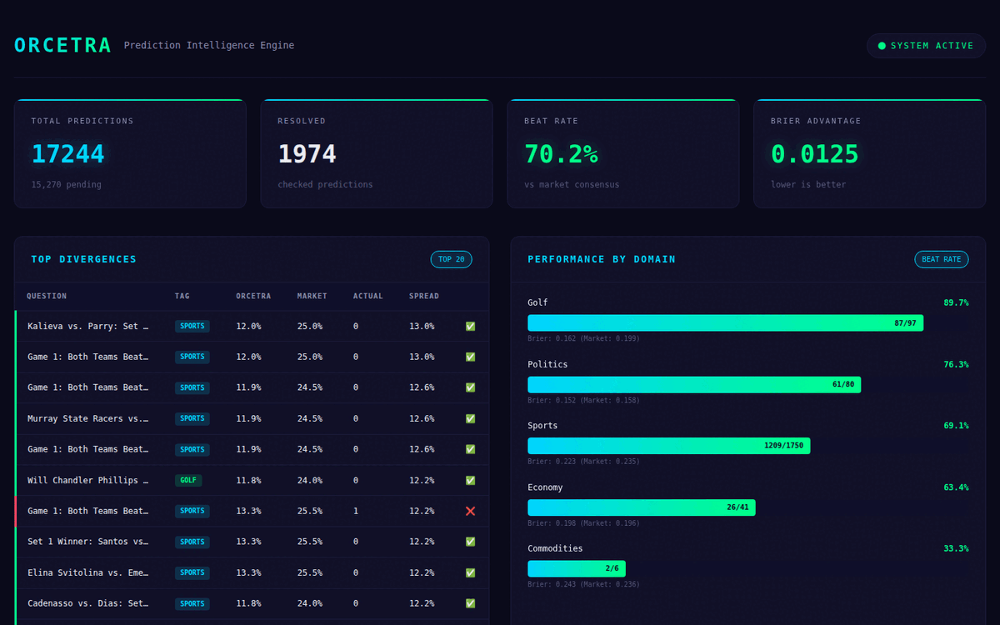

# 🎯 Orcetra — AI Prediction Intelligence Engine

**Beats prediction market consensus 70.2% of the time. Verified on 1,974 real predictions.**

[Live Dashboard](https://orcetra.ai/dashboard.html) · [Website](https://orcetra.ai) · [Paper (coming soon)](#)



---

## What It Does

Orcetra is an automated forecasting engine that monitors prediction markets, applies AI-powered calibration, and generates predictions that consistently outperform market consensus.

## Performance

| Category | Beat Rate | Predictions | Our Brier | Market Brier |
|----------|-----------|-------------|-----------|--------------|
| **Overall** | **70.2%** | **1,974** | **0.217** | **0.229** |
| Golf | 89.7% | 97 | 0.162 | 0.199 |
| Politics | 76.2% | 80 | 0.152 | 0.158 |
| Sports | 69.1% | 1,750 | 0.223 | 0.235 |
| Economy | 63.4% | 41 | 0.198 | 0.196 |

*Lower Brier scores = better calibration. Live tracking of 15,270+ active predictions.*

## How It Works

**Scan** → Monitors Polymarket for active markets across sports, politics, economy, and commodities  
**Predict** → Applies calibration curves learned from 177 resolved markets to correct systematic biases  
**Verify** → Tracks outcomes and computes Brier scores vs market consensus  

## Quick Start

```bash
git clone https://github.com/GuilinDev/orcetra.git
cd orcetra
pip install -r requirements.txt

# Generate predictions for all active markets
python batch_tracker.py predict

# Check for resolved markets and update scores
python auto_check.py

# Generate dashboard
python scripts/gen_dashboard.py
```

## Architecture

```
batch_tracker.py     → Rule-based predictions + calibration correction
auto_check.py        → Outcome verification + Brier score computation  
live_tracker.py      → LLM-powered deep analysis (Groq/Llama 3.1)
scripts/gen_dashboard.py → Dashboard generation + deployment
Cloudflare Pages     → Auto-deploy to orcetra.ai
```

## Why It Works

**Long-shot bias correction**: Markets systematically overprice low-probability events (<20%). Our calibration curves learned from 177+ resolved markets automatically adjust for this bias.

**Market-anchored blending**: 60% calibrated market signal + 40% independent model prediction prevents overconfidence while capturing alpha.

**Real-time data integration**: Economy/commodity predictions incorporate live price feeds and volatility data.

**Automated at scale**: Fully automated pipeline runs 3x daily, tracking 15,000+ active predictions without human intervention.

## Technical Details

- **Calibration curves**: Learned bias correction from historical market data
- **Prediction models**: Ensemble of rule-based heuristics + LLM reasoning
- **Data sources**: Polymarket API, real-time commodity/forex feeds
- **Infrastructure**: Async Python pipeline, JSON data store, web dashboard
- **Evaluation**: Standard Brier score methodology vs market consensus

## Roadmap

- [ ] **Real reasoning chains** per prediction (in progress)
- [ ] **Multi-source news analysis** for event context
- [ ] **Automated betting pipeline** with Kelly criterion sizing
- [ ] **API endpoint** (api.orcetra.ai) for external integrations

## Team

**Beibei Li** — Chief Scientist, CMU AI Professor  
**Kai Zhang** — CEO  
**Guilin Zhang** — CTO  

## License

MIT License

---

*"In markets, as in nature, the wisdom of crowds contains systematic biases. The alpha lies in the correction."*